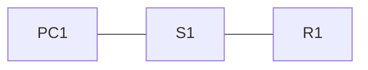

# Module 1 : Configuration de base des périphériques

> Statut : 🟨 en cours

## Objectifs du module

- Configurer les paramètres initiaux d'un commutateur Cisco
- Configurer les ports d'un commutateur (duplex, vitesse)
- Sécuriser l'accès à distance avec SSH
- Configurer les paramètres de base d'un routeur
- Vérifier les réseaux directement connectés

## Sommaire

| Section | Sujet |
|---------|-------|
| 1.1 | [Configuration d'un commutateur avec les paramètres d'origine](#11-configuration-dun-commutateur-avec-les-paramètres-dorigine) |
| 1.2 | [Configuration des ports de commutateur](#12-configuration-des-ports-de-commutateur) |
| 1.3 | [Accès à distance sécurisé](#13-accès-à-distance-sécurisé) |
| 1.4 | [Configuration des paramètres de base d'un routeur](#14-configuration-des-paramètres-de-base-dun-routeur) |
| 1.5 | [Vérification des réseaux directement connectés](#15-vérification-des-réseaux-directement-connectés) |
| 1.6 | [Module pratique et questionnaire](#16-module-pratique-et-questionnaire) |

---

## 1.1 Configuration d'un commutateur avec les paramètres d'origine

### Séquence de démarrage

1. **POST** : le commutateur teste son matériel (CPU, mémoire).
2. **Boot loader** : petit programme en ROM qui initialise le CPU, retrouve le système de fichiers en flash et charge l'IOS.
3. **IOS** : il lit ensuite `startup-config` en NVRAM. Sans fichier, le commutateur démarre avec la configuration d'usine.

Si l'IOS est introuvable ou corrompu, on arrive sur l'invite `switch:` du boot loader. On peut alors lister la flash et lancer une image manuellement :

```
switch: flash_init
switch: dir flash:
switch: boot flash:nom-de-l-image.bin
```

### Modes de commande

| Mode | Invite | Accès |
|------|--------|-------|
| EXEC utilisateur | `S1>` | mode par défaut |
| EXEC privilégié | `S1#` | `enable` |
| Configuration globale | `S1(config)#` | `configure terminal` |
| Configuration de ligne | `S1(config-line)#` | `line console 0`, `line vty 0 15` |
| Configuration d'interface | `S1(config-if)#` | `interface f0/1`, `interface vlan 1` |

`exit` remonte d'un niveau, `end` (ou `Ctrl+Z`) revient directement en mode privilégié.

### Configuration initiale

```
Switch> enable
Switch# configure terminal
Switch(config)# hostname S1
S1(config)# no ip domain-lookup
S1(config)# enable secret MotDePasseFort
S1(config)# line console 0
S1(config-line)# password MotDePasseConsole
S1(config-line)# login
S1(config-line)# exit
S1(config)# line vty 0 15
S1(config-line)# password MotDePasseVty
S1(config-line)# login
S1(config-line)# exit
S1(config)# service password-encryption
S1(config)# banner motd #Accès réservé aux personnes autorisées#
S1(config)# interface vlan 1
S1(config-if)# ip address 192.168.1.2 255.255.255.0
S1(config-if)# no shutdown
S1(config-if)# exit
S1(config)# ip default-gateway 192.168.1.1
S1(config)# end
S1# copy running-config startup-config
```

| Commande | Rôle |
|----------|------|
| `hostname S1` | nom du périphérique |
| `no ip domain-lookup` | évite l'attente d'une résolution DNS après une faute de frappe |
| `enable secret` | protège le mode privilégié (haché, à préférer à `enable password`) |
| `login` | exige le mot de passe sur la ligne (sans lui, il n'est jamais demandé) |
| `service password-encryption` | chiffre faiblement les mots de passe en clair de la configuration |
| `banner motd` | message affiché à la connexion |
| `interface vlan 1` | SVI : adresse IP de gestion du commutateur |
| `ip default-gateway` | passerelle pour joindre le commutateur depuis un autre réseau |
| `copy running-config startup-config` | enregistre la configuration |

> Les mots de passe ci-dessus sont des exemples. Utilisez des mots de passe forts, même dans un lab.

---

## 1.2 Configuration des ports de commutateur

### Duplex et vitesse

- **Half-duplex** : un seul sens à la fois, les collisions sont possibles (CSMA/CD).
- **Full-duplex** : envoi et réception simultanés, aucune collision.
- Par défaut, les ports négocient automatiquement (`auto`). Une **incompatibilité de duplex** entre deux extrémités provoque des erreurs et des lenteurs.

```
S1(config)# interface f0/1
S1(config-if)# description Lien vers R1
S1(config-if)# duplex full
S1(config-if)# speed 100
S1(config-if)# mdix auto
S1(config-if)# no shutdown
```

`mdix auto` permet au port de s'adapter au type de câble (droit ou croisé), sur les modèles qui le prennent en charge.

### Vérification

```
S1# show interfaces f0/1
S1# show interfaces status
S1# show running-config interface f0/1
```

### Erreurs courantes dans `show interfaces`

| Compteur | Sens | Cause probable |
|----------|------|----------------|
| Runts | trames trop courtes (< 64 octets) | collisions, câble défectueux |
| Giants | trames trop longues (> 1518 octets) | carte réseau défaillante |
| CRC | erreur de contrôle de trame | câble, interférences, duplex incompatible |
| Collisions | collisions en sortie | normal en half-duplex |
| Late collisions | collision tardive | duplex incompatible, câble trop long |

---

## 1.3 Accès à distance sécurisé

| | Telnet | SSH |
|---|--------|-----|
| Port | TCP 23 | TCP 22 |
| Chiffrement | non, tout circule en clair | oui |
| Usage | à éviter | à privilégier |

### Configuration de SSH

Prérequis : un nom d'hôte (autre que `Switch`) et un nom de domaine, pour pouvoir générer les clés RSA.

```
S1(config)# ip domain-name exemple.local
S1(config)# crypto key generate rsa modulus 2048
S1(config)# username admin secret MotDePasseFort
S1(config)# ip ssh version 2
S1(config)# line vty 0 15
S1(config-line)# transport input ssh
S1(config-line)# login local
S1(config-line)# exit
```

### Vérification

```
S1# show ip ssh
S1# show ssh
```

Depuis un PC (invite de commandes de Packet Tracer) :

```
PC> ssh -l admin 192.168.1.2
```

> Pour supprimer les clés : `crypto key zeroize rsa`.

---

## 1.4 Configuration des paramètres de base d'un routeur

La configuration initiale ressemble à celle du commutateur (nom, mots de passe, bannière, sauvegarde). La différence : les adresses IP se configurent **sur les interfaces physiques**, qui sont désactivées par défaut.

```
Router> enable
Router# configure terminal
Router(config)# hostname R1
R1(config)# enable secret MotDePasseFort
R1(config)# line console 0
R1(config-line)# password MotDePasseConsole
R1(config-line)# login
R1(config-line)# exit
R1(config)# service password-encryption
R1(config)# banner motd #Accès réservé aux personnes autorisées#
R1(config)# interface g0/0/0
R1(config-if)# description Lien vers LAN 1
R1(config-if)# ip address 192.168.1.1 255.255.255.0
R1(config-if)# ipv6 address 2001:db8:acad:1::1/64
R1(config-if)# no shutdown
R1(config-if)# exit
R1(config)# interface loopback 0
R1(config-if)# ip address 10.0.0.1 255.255.255.255
R1(config-if)# exit
R1(config)# end
R1# copy running-config startup-config
```

- Le nom des interfaces dépend du modèle (`g0/0`, `g0/0/0`, `f0/0`...). Vérifiez avec `show ip interface brief`.
- Pour que le routeur **route** l'IPv6, ajoutez `ipv6 unicast-routing` en mode global.
- Une interface **loopback** est une interface virtuelle, toujours active, utile pour les tests.

---

## 1.5 Vérification des réseaux directement connectés

### Commandes de vérification

| Commande | Affiche |
|----------|---------|
| `show ip interface brief` | état et adresse IPv4 de chaque interface |
| `show ipv6 interface brief` | idem en IPv6 |
| `show interfaces` | détail des interfaces (état, compteurs, erreurs) |
| `show ip interface` | paramètres IPv4 détaillés |
| `show ip route` | table de routage IPv4 |
| `show ipv6 route` | table de routage IPv6 |
| `show running-config` | configuration active |

Dans la table de routage, `C` désigne un réseau **directement connecté** et `L` l'adresse **locale** de l'interface.

### Lire l'état d'une interface

| État de l'interface | Protocole de ligne | Signification |
|---------------------|--------------------|---------------|
| up | up | fonctionne |
| up | down | problème de couche 2 (encapsulation, synchronisation) |
| down | down | problème de couche 1 (câble débranché, port distant éteint) |
| administratively down | down | l'interface a été désactivée avec `shutdown` |

### Filtrer la sortie d'une commande

```
R1# show running-config | section interface
R1# show ip interface brief | include up
R1# show ip interface brief | exclude unassigned
R1# show running-config | begin line vty
```

---

## 1.6 Module pratique et questionnaire

### Lab d'exemple : configuration de base d'un réseau simple



| Périphérique | Interface | Adresse IPv4 | Passerelle |
|--------------|-----------|--------------|------------|
| R1 | G0/0/0 | 192.168.1.1/24 | n/a |
| S1 | VLAN 1 | 192.168.1.2/24 | 192.168.1.1 |
| PC1 | carte réseau | 192.168.1.10/24 | 192.168.1.1 |

Étapes :

1. Configurer les paramètres de base de S1 (section 1.1) et de R1 (section 1.4).
2. Activer SSH sur S1 (section 1.3).
3. Vérifier avec `show ip interface brief` (section 1.5).
4. Tester depuis PC1 :

```
PC> ping 192.168.1.1
PC> ping 192.168.1.2
PC> ssh -l admin 192.168.1.2
```

Fichiers : énoncé et `.pkt` dans [`labs/`](labs/), configurations finales dans [`configs/`](configs/).

> À compléter : titres et résultats des activités Packet Tracer de votre cours pour ce module.

---

## Erreurs fréquentes et dépannage

- **Interface `administratively down`** : `no shutdown` oublié.
- **Le mot de passe n'est jamais demandé** : `login` oublié sous la ligne.
- **SSH ne fonctionne pas** : nom de domaine ou clés RSA manquants, `login local` absent, ou aucun utilisateur créé avec `username`.
- **Erreurs CRC et collisions** : duplex ou vitesse incompatibles, ou câble défectueux.
- **Le commutateur ne répond pas à un ping venant d'un autre réseau** : passerelle (`ip default-gateway`) manquante.
- **Configuration perdue au redémarrage** : `copy running-config startup-config` oublié.

## Questions de révision

<details>
<summary>1. Quelle commande enregistre la configuration en cours pour qu'elle survive à un redémarrage ?</summary>

`copy running-config startup-config`
</details>

<details>
<summary>2. Pourquoi préférer SSH à Telnet ?</summary>

SSH chiffre les échanges (identifiants compris), alors que Telnet envoie tout en clair.
</details>

<details>
<summary>3. Une interface affiche « up / down ». Sur quelle couche chercher le problème ?</summary>

Sur la couche 2 (liaison de données) : encapsulation, synchronisation ou configuration du protocole de ligne.
</details>

<details>
<summary>4. Que signifie « administratively down » ?</summary>

L'interface a été désactivée par la commande `shutdown`. Il faut saisir `no shutdown`.
</details>

<details>
<summary>5. Quelle est la différence entre `C` et `L` dans la table de routage ?</summary>

`C` est le réseau directement connecté, `L` est l'adresse IP locale de l'interface elle-même.
</details>