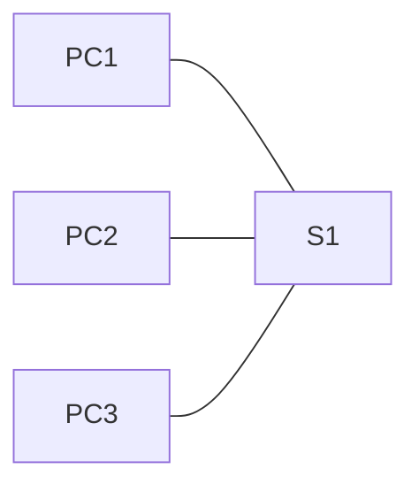

# Module 2 : Concepts de commutation

> Statut : ⬜ à faire (page pré-remplie à relire après le cours)

## Objectifs du module

- Expliquer comment un commutateur transfère les trames Ethernet
- Décrire la construction de la table d'adresses MAC
- Comparer les méthodes de transfert des commutateurs
- Distinguer domaine de collision et domaine de diffusion

## Sommaire

| Section | Sujet |
|---------|-------|
| 2.1 | [Transfert de trame](#21-transfert-de-trame) |
| 2.2 | [Domaines de commutation](#22-domaines-de-commutation) |
| 2.3 | [Module pratique et questionnaire](#23-module-pratique-et-questionnaire) |

---

## 2.1 Transfert de trame

### La trame Ethernet

| Champ | Taille | Rôle |
|-------|--------|------|
| Préambule + SFD | 8 octets | synchronisation |
| Adresse MAC destination | 6 octets | destinataire |
| Adresse MAC source | 6 octets | expéditeur |
| Type | 2 octets | protocole encapsulé (0x0800 = IPv4) |
| Données | 46 à 1500 octets | contenu (charge utile) |
| FCS | 4 octets | contrôle d'erreurs (CRC) |

Taille d'une trame : de **64 à 1518 octets** (1522 avec l'étiquette VLAN 802.1Q). Une trame plus petite est un *runt*, plus grande un *giant*.

### Fonctionnement d'un commutateur

Un commutateur repose sur sa **table d'adresses MAC** (aussi appelée table CAM) et sur deux opérations : **apprendre** puis **transférer**.

**Apprentissage** : à chaque trame reçue, il note l'adresse MAC **source** et le port d'arrivée.

**Transfert** : il consulte l'adresse MAC **destination**.

| Cas | Action |
|-----|--------|
| Destination connue | la trame est envoyée uniquement sur le port associé (**filtrage**) |
| Destination inconnue (unicast inconnu) | la trame est envoyée sur tous les ports sauf celui de réception (**inondation**) |
| Diffusion (`FF:FF:FF:FF:FF:FF`) | inondation sur tous les ports sauf celui de réception |

Déroulé pour un PC-A qui envoie à un PC-B inconnu :

1. Le commutateur reçoit la trame de PC-A et enregistre MAC-A et son port.
2. MAC-B est inconnue, la trame est inondée sur tous les autres ports.
3. PC-B répond : le commutateur apprend MAC-B et son port.
4. Les échanges suivants sont envoyés directement, sans inondation.

Les entrées inutilisées expirent après **300 secondes** par défaut (*aging time*).

```
S1# show mac address-table
S1# show mac address-table dynamic
S1# show mac address-table aging-time
S1# clear mac address-table dynamic
```

### Méthodes de transfert

| Méthode | Fonctionnement | Avantage | Inconvénient |
|---------|----------------|----------|--------------|
| **Store-and-forward** | reçoit toute la trame, vérifie le FCS, puis transfère | élimine les trames erronées, permet la QoS et les ports de vitesses différentes | latence plus élevée |
| **Cut-through, fast-forward** | transfère dès la lecture de l'adresse destination | latence minimale | peut propager des trames erronées |
| **Cut-through, fragment-free** | attend les 64 premiers octets avant de transférer | filtre les fragments de collision | vérifie seulement le début de la trame |

Store-and-forward est la méthode utilisée par les commutateurs Cisco actuels.

### Mise en mémoire tampon

- **Par port** : chaque port a sa file d'attente, une trame peut être retardée par celles qui la précèdent.
- **Partagée** : mémoire commune à tous les ports, allouée dynamiquement, adaptée aux ports de vitesses différentes.

---

## 2.2 Domaines de commutation

### Domaine de collision

Ensemble des périphériques dont les transmissions peuvent entrer en collision.

- Un **concentrateur (hub)** partage un seul domaine de collision entre tous ses ports (half-duplex, CSMA/CD).
- Sur un **commutateur**, chaque port forme son propre domaine de collision. En full-duplex, il n'y a plus de collisions.

### Domaine de diffusion

Ensemble des périphériques qui reçoivent une trame de diffusion émise par l'un d'eux.

- Un commutateur **transmet** les diffusions sur tous ses ports : tous ses ports (d'un même VLAN) sont dans le même domaine de diffusion.
- Un **routeur** ne transmet pas les diffusions : chacune de ses interfaces délimite un domaine de diffusion.
- Les **VLAN** (module 3) permettent de découper un commutateur en plusieurs domaines de diffusion.

| | Délimité par |
|---|--------------|
| Domaine de collision | chaque port de commutateur |
| Domaine de diffusion | routeur ou VLAN |

### Problèmes des grands domaines de diffusion

Trop de diffusions consomment de la bande passante et du temps de traitement sur chaque hôte. Une boucle réseau peut provoquer une **tempête de diffusion**, qui sature tout le réseau (voir le module 5 sur le STP).

### Atténuer la congestion

- Utiliser des liens plus rapides et le **full-duplex**.
- Regrouper plusieurs liens en un seul (EtherChannel, module 6).
- Segmenter le réseau en VLAN ou en sous-réseaux.
- S'appuyer sur la mise en mémoire tampon des commutateurs.

---

## 2.3 Module pratique et questionnaire

### Lab d'exemple : observer la table d'adresses MAC



Étapes :

1. Sur S1, vider la table : `clear mac address-table dynamic`.
2. Afficher la table : `show mac address-table`. Elle doit être presque vide.
3. Faire un `ping` de PC1 vers PC2.
4. Réafficher la table et relever quelles adresses MAC et quels ports ont été appris.
5. Attendre ou relancer des pings depuis PC3 et observer les nouvelles entrées.

Fichiers : énoncé et `.pkt` dans [`labs/`](labs/), configurations finales dans [`configs/`](configs/).

> À compléter : titres et résultats des activités Packet Tracer de votre cours pour ce module.

---

## Erreurs fréquentes

- Confondre **domaine de collision** (un par port de commutateur) et **domaine de diffusion** (un par VLAN ou interface de routeur).
- Croire qu'un commutateur ne fait jamais d'inondation : c'est le cas pour les diffusions et les unicast inconnus.
- Oublier que l'apprentissage se fait sur l'adresse **source**, jamais sur la destination.

## Questions de révision

<details>
<summary>1. Sur quelle adresse le commutateur construit-il sa table MAC ?</summary>

Sur l'adresse MAC source de chaque trame reçue, associée au port d'arrivée.
</details>

<details>
<summary>2. Que fait un commutateur d'une trame dont la destination est inconnue ?</summary>

Il l'envoie sur tous ses ports sauf celui de réception (inondation).
</details>

<details>
<summary>3. Quelle méthode de transfert vérifie le FCS avant d'envoyer la trame ?</summary>

Store-and-forward.
</details>

<details>
<summary>4. Combien de domaines de collision et de diffusion pour un commutateur de 24 ports sans VLAN ?</summary>

24 domaines de collision (un par port) et un seul domaine de diffusion.
</details>

<details>
<summary>5. Quel équipement sépare les domaines de diffusion ?</summary>

Un routeur (ou un VLAN sur un commutateur).
</details>